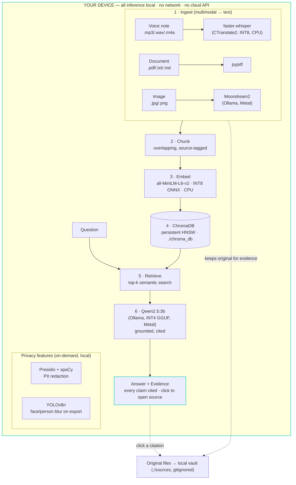

# Architecture — LocalWitness

A private, fully on-device multimodal RAG system: ingest voice / documents /
images, index them locally, answer questions with clickable citations — with
the network disconnected.

## System diagram

## Model pipeline

| # | Stage | Model / library | Runtime | Where it runs |
|---|---|---|---|---|
| 1 | Speech-to-text | faster-whisper `base` (INT8) | CTranslate2 | CPU |
| 1 | Document text | pypdf | native Python | CPU |
| 1 | Image → text | Moondream2 | Ollama (llama.cpp) | Apple GPU / Metal |
| 2 | Chunking | custom, overlapping | native Python | CPU |
| 3 | Embeddings | all-MiniLM-L6-v2 (INT8 ONNX) | ONNX Runtime | CPU |
| 4 | Vector store | ChromaDB (HNSW, cosine) | local, on-disk | CPU |
| 5 | Retrieval | top-k semantic search | ChromaDB + embed | CPU |
| 6 | Answering | qwen2.5:3b (INT4 GGUF) | Ollama (llama.cpp) | Apple GPU / Metal |
| — | PII redaction | Presidio + spaCy `en_core_web_lg` | spaCy | CPU |
| — | Privacy blur | YOLOv8n | Ultralytics + OpenCV | CPU |

## Data flow

1. **Ingest** — a file is turned into text by the matching model (audio→Whisper,
   PDF→pypdf, image→Moondream). The **original file is copied into a local vault**
   (`./sources`, gitignored) so a citation can later reopen the true source.
2. **Chunk** — text is split into overlapping, source-tagged chunks (audio chunks
   carry timestamps; PDF chunks carry page numbers) so every chunk knows exactly
   where it came from.
3. **Embed** — each chunk → a 384-dim vector via the INT8 ONNX MiniLM.
4. **Index** — vectors + text + metadata are persisted in ChromaDB on disk.
5. **Retrieve** — a question is embedded with the *same* model and matched against
   the index; the top-k chunks come back with similarity scores.
6. **Answer** — retrieved chunks are handed to Qwen2.5 with a strict grounding
   prompt. Every sentence must carry a citation copied from a retrieved chunk, or
   the model must reply *"That's not in my notes."* The UI renders the answer with
   inline citations and an evidence panel; clicking a citation opens the real
   source at the cited spot (PDF page rendered with the passage outlined, audio
   cued to the timestamp, text highlighted in context).

## Local vs. cloud components

| Component | Location |
|---|---|
| Speech-to-text, embeddings, vector search, LLM, VLM, PII, blur | **100% on-device** |
| UI (Streamlit) | **on-device** — served on `localhost`, the browser is only the front-end |
| UI fonts | **bundled in the repo** — no CDN, loads offline |
| Cloud / external services | **none** — there is no API key anywhere in the codebase |
| First-run model weights | one-time download to `./models`; offline forever after |

The only network sockets the app opens are **loopback** (`127.0.0.1:11434`, the
local Ollama server). This is proven, not asserted — see
[`scripts/verify_offline.py`](scripts/verify_offline.py), which blocks every
non-loopback connection and runs the full pipeline (**zero outbound connections**).

## Key design decisions

- **Grounding over fluency.** The system is tuned to say *"That's not in my
  notes"* rather than guess. For contracts and medical records, a confident wrong
  answer is far more dangerous than a missing one. Measured: **zero hallucinations**
  across the unanswerable test set ([`scripts/evaluate.py`](scripts/evaluate.py)).
- **Citations are load-bearing, not decoration.** Chunks are tagged with
  timestamps/pages at index time so a citation can reopen the *exact* source
  location. This is why the original files are vaulted locally.
- **Offline-first, not offline-only.** Model weights download once, then every
  load is forced local (`local_files_only`, `YOLO_OFFLINE`, telemetry disabled).
  The claim is *zero non-loopback connections*, and it is enforced by a test.
- **Quantization is shipped, not benchmarked-and-shelved.** The app's default
  embedding backend is the INT8 ONNX model (4× smaller, 3.5× faster); it falls
  back to PyTorch only if the quantized artifact is missing.
- **Prove every claim.** Two executable receipts — `verify_offline.py` (privacy)
  and `evaluate.py` (grounding) — each caught real bugs the running app and code
  review had missed. That is the whole argument for shipping them.

See [TECHNICAL_REPORT.md](TECHNICAL_REPORT.md) for measured performance and
[PRIVACY.md](PRIVACY.md) for the data-handling and safety statement.
