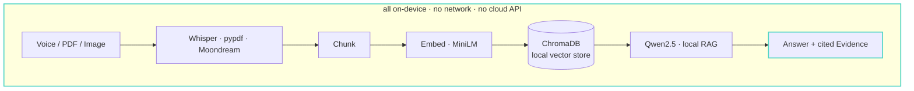

# LocalWitness

**Your memory, on-device.** A private, fully offline multimodal second brain:
drop in voice notes, documents, and photos — LocalWitness transcribes, describes,
and indexes them locally, then answers questions with cited evidence. No
cloud, no account, no network required.

*Built solo for OSDHack 2026 (theme: On-Device AI).*

## Why LocalWitness?

**Everything runs on your device.** Speech recognition, vision, embeddings,
retrieval, reasoning, and PII redaction — all local. **No cloud APIs. No
account. No network.**

**Every answer is backed by evidence** — a citation on every claim, or an
honest "That's not in my notes." Unlike cloud note assistants, your documents
never leave the machine.

## Architecture



## Problem

People accumulate voice notes, contracts, meeting notes, and photos that hold
their most sensitive information — legal, medical, financial, journalistic.
Every mainstream "second brain" or AI-search tool demands that content be
uploaded to someone else's server, so the people who most need searchable
memory face the worst privacy trade-off. Speech, images, and PII end up in
third-party logs, training sets, and breach dumps. The trade-off is
unnecessary: modern quantized models make the whole pipeline feasible on a
laptop.

## Solution

LocalWitness **runs the entire pipeline on your machine**: speech-to-text,
image captioning, semantic indexing, and a local LLM that answers questions
**only from your own material, with a citation on every claim** — `[source @
timestamp]` or `[document, page N]` — and says "That's not in my notes"
rather than guessing. **Disconnect the network and everything still works.**
Nothing ever leaves the device.

## On-Device AI usage

| Capability | Runs | Model |
|---|---|---|
| Speech-to-text | **locally** | faster-whisper `base` |
| Text embeddings + semantic search | **locally** | all-MiniLM-L6-v2 + ChromaDB |
| Question answering (RAG, cited) | **locally** | qwen2.5:3b via Ollama |
| Image description + text-in-image | **locally** | Moondream2 via Ollama |
| Privacy blur on image export | **locally** | YOLOv8n |
| PII detection & redaction | **locally** | Presidio + spaCy |
| Cloud / optional support | **none required** | — |

**The browser is only the interface.** Streamlit serves the UI on
`localhost`; **every model runs natively on the device** via Ollama
(llama.cpp/Metal), CTranslate2, and PyTorch. **No cloud AI API is called for
any feature — there is no API key anywhere in the codebase.** Even the UI
fonts are bundled in the repo, so the interface itself loads offline.

### Privacy receipts

We didn't just claim privacy — we audited the dependency chain for network
calls and closed every leak we found:

1. **ChromaDB** ships with anonymized telemetry enabled — disabled explicitly
   in our client settings ([localwitness/index/store.py](localwitness/index/store.py)).
2. **HuggingFace hub** revalidates cached models over the network on every
   load — loads are forced offline-first once weights are downloaded
   ([localwitness/index/embed.py](localwitness/index/embed.py)).
3. **Ultralytics** ships with usage analytics ("sync") enabled — disabled at
   import time ([localwitness/privacy/blur.py](localwitness/privacy/blur.py)).

**Verify it yourself:** disconnect the network and run the full flow —
upload, index, ask, cited answer. It all works. Zero outbound requests.

## Tech stack

Python 3.11 · Streamlit (local UI) · faster-whisper · sentence-transformers
(all-MiniLM-L6-v2) · ChromaDB · Ollama (qwen2.5:3b + moondream) · Ultralytics
YOLOv8n · Microsoft Presidio + spaCy · pypdf.

Cross-platform: anything that runs Python + Ollama can run LocalWitness. Tested on
Apple Silicon (M-series MacBook Air, CPU/MPS/Metal) — all numbers below were
measured on that machine; the in-app **Metrics tab** re-measures them live on
whatever machine the app runs on.

## Models & performance

| Stage | Model | License | Approx size | Measured |
|---|---|---|---|---|
| Speech-to-text | [faster-whisper `base`](https://github.com/SYSTRAN/faster-whisper) (int8) | MIT | ~145 MB | ~5–7 s per minute of audio |
| Embeddings | [all-MiniLM-L6-v2](https://huggingface.co/sentence-transformers/all-MiniLM-L6-v2) (384-dim) | Apache-2.0 | ~90 MB | ~90 ms per chunk |
| Vector search | [ChromaDB](https://github.com/chroma-core/chroma) (persistent, HNSW) | Apache-2.0 | n/a (library) | ~330 ms per query (incl. query embedding) |
| Answering | [qwen2.5:3b](https://ollama.com/library/qwen2.5) (INT4 GGUF) via Ollama | Apache-2.0 | ~1.9 GB | ~46 tokens/sec, 1–3.5 s per answer |
| Image captioning | [Moondream2](https://ollama.com/library/moondream) via Ollama | Apache-2.0 | ~1.7 GB | ~4 s per image (two VLM passes) |
| Privacy blur | [YOLOv8n](https://github.com/ultralytics/ultralytics) | AGPL-3.0 | ~6 MB | measured live in Metrics tab |
| PII redaction | [Presidio](https://github.com/microsoft/presidio) + spaCy `en_core_web_lg` | MIT | ~590 MB | measured live in Metrics tab |

### Optimization: INT8 quantization

[scripts/quantize_embeddings.py](scripts/quantize_embeddings.py) exports the
embedding model to ONNX and applies dynamic INT8 quantization — measured on
the same machine as everything else:

| all-MiniLM-L6-v2 | size | ms/query (single) |
|---|---|---|
| PyTorch (app default) | 91.6 MB | 4.7 |
| ONNX INT8 (CPU) | 22.9 MB | 1.4 |

**Footprint 4.0× smaller, single-query latency 3.5× faster** — and the LLM
(qwen2.5:3b) is likewise already INT4-quantized GGUF via Ollama (~6 GB fp16 →
~1.9 GB on disk).

### Customization: fine-tuning YOLOv8n

The privacy-blur detector can be fine-tuned to protect *your* sensitive class
(e.g. ID cards, badges, license plates) —
[scripts/finetune_yolo.py](scripts/finetune_yolo.py) is the whole loop:

```bash
python scripts/finetune_yolo.py --make-sample-data 60
python scripts/finetune_yolo.py --epochs 10 --imgsz 320
```

Pretrained YOLOv8n knows 80 COCO classes and cannot detect a novel class at
all, so fine-tuning takes its mAP from **0.000** to a working detector:

| | mAP50 | mAP50-95 |
|---|---|---|
| Before (pretrained, class unknown) | 0.000 | 0.000 |
| After (fine-tuned, tiny sample run) | 0.995 | 0.949 |

*(Measured: 10 epochs, imgsz 320, Apple Silicon MPS — a ~2-minute run on the
60-image synthetic sample; exported weights are 6.2 MB. Train anywhere —
inference stays 100% local.)*

## Setup

Prereqs: Python 3.11 and [Ollama](https://ollama.com) installed and running.

```bash
git clone <repo> && cd localwitness
python3.11 -m venv .venv && source .venv/bin/activate
pip install -r requirements.txt
python -m spacy download en_core_web_lg   # local NER model for PII redaction
ollama pull qwen2.5:3b                    # local LLM for cited answers
ollama pull moondream                     # local VLM for image captioning
streamlit run app.py
```

Evidence rows can open the cited source in context (text window, rendered
PDF page, audio seeked to the timestamp) — PyMuPDF handles the PDF page
render and installs with the requirements above.

First run downloads the Whisper and MiniLM weights into `models/` (one-time,
~250 MB); everything is offline from then on. `sample_data/` contains demo
files to try immediately.

## Usage

1. **Upload** — drop in a voice note (`.mp3/.wav/.m4a`), document
   (`.pdf/.txt/.md`), or photo (`.jpg/.png`) and watch the live pipeline
   transcribe/describe → chunk → embed → index it, all locally. Photos can
   also be exported privacy-safe with detected people blurred.
2. **Library** — everything indexed so far, plus semantic search (try
   something vague like "money stuff").
3. **Ask** — one question → one standalone answer with inline citations and
   an EVIDENCE list showing the exact retrieved excerpts and their measured
   similarity. Optional toggle redacts PII (names, emails, phones, IDs →
   `[PERSON]`-style tags) before the answer is shown.
4. **Metrics** — the local AI stack, storage footprint, and live-measured
   performance numbers for every stage.

## Demo & screenshots

**Demo video:** `[demo video link]`

Screenshots available in the Unstop submission.

## Known limitations

- **Redaction covers content; filenames are preserved for citation
  integrity.** A citation like `[sarah_followup_call.m4a @ 00:00]` still
  reveals a name through the filename even when the answer body is redacted.
  Citations are the product's spine, so hiding them would break
  verifiability — mind what you name your files, or rename sources before
  indexing anything you plan to share redacted.
- **Privacy blur has a detection floor:** tiny faces cropped at the image
  border can fall below what YOLOv8n (a nano model) can detect — one such
  bystander face survived blurring in our test photo. Review exports before
  sharing.
- **qwen2.5:3b is a small local model.** Answers are grounded in retrieved
  context by design, and it says "That's not in my notes" rather than guess —
  but complex multi-step reasoning is limited compared to large cloud models.
  That is the trade-off for full privacy, and it's the right one for this
  product.

## Future scope

- **Evidence relationship graph** — visualize which sources support which
  answers and how sources corroborate each other.
- **Timeline view** — indexed notes and cited moments on a time axis.
- **Encrypted local backup** — optional at-rest encryption for the vault.
- **Edge capture companion** — e.g. an ESP32 wake-word recorder that drops
  voice notes straight into the vault.

## Credits & licenses

LocalWitness's own code is **MIT-licensed** (`LICENSE` at the repo root). Every
model and library it uses, with licenses:

- **Object detection uses [Ultralytics YOLOv8n](https://github.com/ultralytics/ultralytics), licensed AGPL-3.0.**
  (LocalWitness's own code remains MIT — we use the AGPL library, we don't relicense it.)
- [faster-whisper](https://github.com/SYSTRAN/faster-whisper) (MIT) — speech-to-text, Whisper `base` weights by OpenAI (MIT)
- [sentence-transformers](https://www.sbert.net/) / [all-MiniLM-L6-v2](https://huggingface.co/sentence-transformers/all-MiniLM-L6-v2) (Apache-2.0) — embeddings
- [ChromaDB](https://github.com/chroma-core/chroma) (Apache-2.0) — local vector store
- [Ollama](https://ollama.com) (MIT) with [Qwen2.5 3B](https://ollama.com/library/qwen2.5) (Apache-2.0) — local LLM
- [Moondream2](https://ollama.com/library/moondream) (Apache-2.0) — image captioning
- [Microsoft Presidio](https://github.com/microsoft/presidio) (MIT) with [spaCy](https://spacy.io) `en_core_web_lg` (MIT) — PII detection & redaction
- [Streamlit](https://streamlit.io) (Apache-2.0) — UI · [pypdf](https://github.com/py-pdf/pypdf) (BSD-3-Clause) · [python-docx](https://github.com/python-openxml/python-docx) (MIT) · [OpenCV](https://opencv.org) (Apache-2.0) · [NumPy](https://numpy.org) (BSD-3-Clause)
- UI fonts [Inter](https://rsms.me/inter/) (SIL OFL 1.1) and [JetBrains Mono](https://www.jetbrains.com/lp/mono/) (SIL OFL 1.1), bundled locally so the interface loads offline
